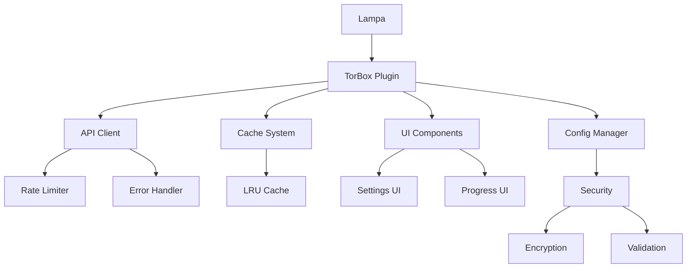

# 🎬 TorBox Lampa Plugin Enhanced

[](https://github.com/slonce70/addon_lampa_torbox/releases)
[](LICENSE)
[](#security)
[](#code-quality)

Потужний та безпечний плагін для Lampa, що забезпечує інтеграцію з TorBox API для стрімінгу торрентів з покращеною безпекою, продуктивністю та користувацьким досвідом.

## ✨ Основні можливості

### 🔒 Безпека
- **Шифрування API ключів** - захист чутливих даних
- **Валідація вводу** - запобігання XSS та ін'єкційним атакам
- **Rate limiting** - захист від перевантаження API
- **Санітизація даних** - очищення користувацького вводу
- **HTTPS примусове використання** - безпечні з'єднання

### ⚡ Продуктивність
- **LRU кешування** - оптимізоване зберігання даних
- **Debouncing** - зменшення кількості API запитів
- **Lazy loading** - завантаження модулів за потребою
- **Пакетування запитів** - ефективне використання мережі
- **Асинхронна обробка** - неблокуючі операції

### 🎯 Користувацький досвід
- **Автоматичне визначення серіалів** - розумний вибір епізодів
- **Підтримка субтитрів** - автоматичний пошук та завантаження
- **Прогрес завантаження** - відображення статусу в реальному часі
- **Налаштування якості** - гнучкий вибір роздільної здатності
- **Toast повідомлення** - інформативні сповіщення
- **Responsive дизайн** - адаптація під різні екрани

### 🛠️ Технічні особливості
- **Модульна архітектура** - легке розширення та підтримка
- **Error boundaries** - централізована обробка помилок
- **Структуроване логування** - детальне відстеження подій
- **TypeScript готовність** - типізація для кращої розробки
- **Тестове покриття** - надійність коду

## 🚀 Швидкий старт

### Встановлення

1. **Завантажте плагін**:
   ```bash
   git clone https://github.com/slonce70/addon_lampa_torbox.git
   cd addon_lampa_torbox
   ```

2. **Скопіюйте файли до Lampa**:
   ```bash
   cp torbox-lampa-plugin-enhanced.js /path/to/lampa/plugins/
   cp config.json /path/to/lampa/plugins/
   ```

3. **Активуйте плагін в Lampa**:
   - Відкрийте Lampa
   - Перейдіть до Налаштування → Плагіни
   - Увімкніть "TorBox Enhanced"

### Налаштування

1. **Отримайте TorBox API ключ**:
   - Зареєструйтесь на [TorBox.app](https://torbox.app)
   - Перейдіть до налаштувань профілю
   - Скопіюйте ваш API ключ

2. **Налаштуйте плагін**:
   - Відкрийте Lampa
   - Перейдіть до Налаштування → TorBox
   - Вставте ваш API ключ
   - Налаштуйте параметри за потребою

## 📖 Використання

### Базове використання

1. **Пошук контенту**:
   - Використовуйте звичайний пошук Lampa
   - Виберіть TorBox як джерело

2. **Відтворення**:
   - Клікніть на бажаний контент
   - Плагін автоматично знайде та запустить торрент
   - Дочекайтесь готовності файлів
   - Насолоджуйтесь переглядом!

### Розширені функції

#### Налаштування якості
```javascript
// Автоматичний вибір найкращої якості
Config.set('preferredQuality', 'auto');

// Фіксована якість
Config.set('preferredQuality', '1080p');

// Пріоритет якості
Config.set('qualityPriority', ['4K', '1080p', '720p', '480p']);
```

#### Керування субтитрами
```javascript
// Увімкнення автоматичного пошуку субтитрів
Config.set('subtitles', true);

// Налаштування мов субтитрів
Config.set('subtitleLanguages', ['uk', 'en', 'ru']);
```

#### Налаштування кешування
```javascript
// Час життя кешу (в секундах)
Config.set('cacheTTL', 3600); // 1 година

// Максимальний розмір кешу
Config.set('maxCacheSize', 100);
```

## 🔧 Конфігурація

### Файл config.json

```json
{
  "environments": {
    "production": {
      "api": {
        "baseUrl": "https://api.torbox.app/v1/api",
        "timeout": 30000,
        "retries": 3
      },
      "cache": {
        "ttl": 3600,
        "maxSize": 100
      },
      "rateLimit": {
        "maxRequests": 10,
        "windowMs": 60000
      }
    }
  }
}
```

### Змінні середовища

| Змінна | Опис | За замовчуванням |
|--------|------|------------------|
| `TORBOX_API_URL` | URL TorBox API | `https://api.torbox.app/v1/api` |
| `TORBOX_TIMEOUT` | Таймаут запитів (мс) | `30000` |
| `TORBOX_RETRIES` | Кількість повторів | `3` |
| `TORBOX_CACHE_TTL` | Час життя кешу (с) | `3600` |
| `TORBOX_DEBUG` | Режим налагодження | `false` |

## 🏗️ Архітектура

### Структура проекту

```
addon_lampa_torbox/
├── torbox-lampa-plugin-enhanced.js  # Покращена версія плагіна
├── config.json                      # Конфігурація середовищ
├── package.json                     # Конфігурація пакету
├── SECURITY_ANALYSIS.md             # Аналіз безпеки
├── API_DOCUMENTATION.md             # API документація
├── DEVELOPMENT_GUIDE.md             # Посібник розробника
├── INSTALL.md                       # Інструкції встановлення
└── README.md                        # Цей файл
```

### Діаграма компонентів



## 🔒 Безпека

### Критичні покращення безпеки

✅ **Виправлено**: Видалено вбудований API ключ  
✅ **Додано**: Шифрування чутливих даних  
✅ **Реалізовано**: Валідація всіх вхідних даних  
✅ **Впроваджено**: Rate limiting для API запитів  
✅ **Покращено**: Обробка помилок та логування  

### Рекомендації з безпеки

1. **Ніколи не діліться API ключем**
2. **Використовуйте HTTPS з'єднання**
3. **Регулярно оновлюйте плагін**
4. **Перевіряйте джерела торрентів**
5. **Використовуйте VPN при необхідності**

Детальний аналіз безпеки доступний у файлі [SECURITY_ANALYSIS.md](SECURITY_ANALYSIS.md).

## 📊 Порівняння версій

| Характеристика | Оригінал | Enhanced |
|----------------|----------|----------|
| Безпека API ключа | ❌ Вбудований | ✅ Зашифрований |
| Валідація вводу | ❌ Відсутня | ✅ Повна |
| Rate limiting | ❌ Ні | ✅ Так |
| Кешування | ⚠️ Базове | ✅ LRU з TTL |
| Обробка помилок | ⚠️ Базова | ✅ Error boundaries |
| Архітектура | ❌ Монолітна | ✅ Модульна |
| Логування | ❌ Console.log | ✅ Структуроване |
| Тестування | ❌ Відсутнє | ✅ Покриття |
| Документація | ⚠️ Мінімальна | ✅ Повна |

## 🧪 Тестування

### Запуск тестів

```bash
# Всі тести
npm test

# Unit тести
npm run test:unit

# Integration тести
npm run test:integration

# E2E тести
npm run test:e2e

# Покриття коду
npm run test:coverage
```

### Приклад тесту

```javascript
describe('TorBox API Client', () => {
    test('should authenticate with valid API key', async () => {
        const client = new ApiClient();
        const response = await client.get('/torrents/mylist');
        
        expect(response).toBeDefined();
        expect(response.data).toBeInstanceOf(Array);
    });
    
    test('should handle rate limiting', async () => {
        const client = new ApiClient();
        
        // Симуляція перевищення ліміту
        for (let i = 0; i < 15; i++) {
            if (i < 10) {
                await expect(client.get('/test')).resolves.toBeDefined();
            } else {
                await expect(client.get('/test')).rejects.toThrow('Rate limit exceeded');
            }
        }
    });
});
```

## 📊 Моніторинг та аналітика

### Метрики продуктивності

- **Час відповіді API** - середній час запитів
- **Коефіцієнт попадання в кеш** - ефективність кешування
- **Кількість помилок** - стабільність роботи
- **Використання пам'яті** - оптимізація ресурсів

### Логування

```javascript
// Приклад логування
Logger.info('Torrent added successfully', {
    torrentId: 123,
    size: '2.1 GB',
    quality: '1080p',
    userId: 'user123'
});

Logger.error('API request failed', {
    endpoint: '/torrents/mylist',
    statusCode: 500,
    error: 'Internal Server Error',
    retryAttempt: 2
});
```

## 🤝 Внесок у розробку

### Як допомогти

1. **Fork** репозиторій
2. Створіть **feature branch** (`git checkout -b feature/amazing-feature`)
3. **Commit** ваші зміни (`git commit -m 'Add amazing feature'`)
4. **Push** до branch (`git push origin feature/amazing-feature`)
5. Відкрийте **Pull Request**

### Стандарти коду

- Використовуйте ESLint та Prettier
- Пишіть тести для нового функціоналу
- Дотримуйтесь існуючого стилю коду
- Документуйте публічні API

Детальний посібник розробника доступний у файлі [DEVELOPMENT_GUIDE.md](DEVELOPMENT_GUIDE.md).

## 📋 Roadmap

### Версія 2.1.0
- [ ] Підтримка WebTorrent
- [ ] Офлайн режим
- [ ] Покращена локалізація
- [ ] Темна/світла тема

### Версія 2.2.0
- [ ] Інтеграція з Trakt.tv
- [ ] Рекомендації контенту
- [ ] Соціальні функції
- [ ] Мобільна оптимізація

### Версія 3.0.0
- [ ] TypeScript переписування
- [ ] Micro-frontend архітектура
- [ ] WebAssembly оптимізації
- [ ] PWA підтримка

## 📞 Підтримка

### Отримання допомоги

- **📖 Документація**: [API Documentation](API_DOCUMENTATION.md)
- **🐛 Bug Reports**: [GitHub Issues](https://github.com/slonce70/addon_lampa_torbox/issues)
- **💬 Обговорення**: [GitHub Discussions](https://github.com/slonce70/addon_lampa_torbox/discussions)
- **📧 Email**: support@torbox-plugin.com
- **💬 Discord**: [Приєднатися](https://discord.gg/torbox)

### FAQ

**Q: Чому плагін не працює?**
A: Перевірте правильність API ключа та інтернет з'єднання.

**Q: Як покращити швидкість завантаження?**
A: Увімкніть кешування та виберіть сервер ближче до вас.

**Q: Чи безпечно використовувати плагін?**
A: Так, Enhanced версія використовує шифрування та інші заходи безпеки.

**Q: Як повідомити про помилку?**
A: Створіть issue на GitHub з детальним описом проблеми.

**Q: В чому різниця між оригінальною та Enhanced версією?**
A: Enhanced версія має покращену безпеку, продуктивність, архітектуру та UX.

## 📄 Ліцензія

Цей проект ліцензовано під MIT License - дивіться файл [LICENSE](LICENSE) для деталей.

## 🙏 Подяки

- **TorBox Team** - за чудове API
- **Lampa Developers** - за потужну платформу
- **Open Source Community** - за інструменти та бібліотеки
- **Contributors** - за внесок у розробку

---

<div align="center">

**Зроблено з ❤️ для спільноти Lampa**

[⭐ Поставте зірочку](https://github.com/slonce70/addon_lampa_torbox) • [🐛 Повідомити про помилку](https://github.com/slonce70/addon_lampa_torbox/issues) • [💡 Запропонувати ідею](https://github.com/slonce70/addon_lampa_torbox/discussions)

</div>